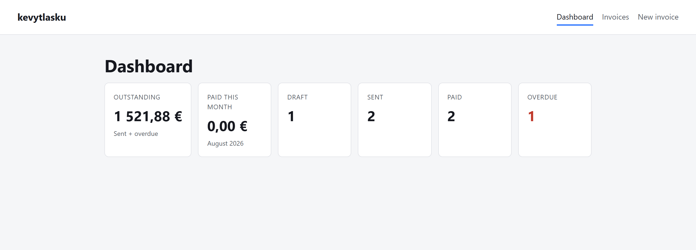

# kevytlasku

An invoicing app for Finnish light entrepreneurs (*kevytyrittäjät*) — people who bill clients
through a service that takes a percentage-based fee per invoice, without running their own
company. Create an invoice, track its status, and see exactly what you'd be paid after Finnish
VAT and that service fee.

**Live demo:** _deploying — link goes here_
**Repo:** https://github.com/Zwekhant2/kevytlasku

## Run it locally

```
git clone https://github.com/Zwekhant2/kevytlasku.git
cd kevytlasku
npm install && npm run dev          # http://localhost:5173
```

In a second terminal (needs the [.NET 8 SDK](https://dotnet.microsoft.com/download/dotnet/8.0)):

```
cd api && dotnet run                # http://localhost:5200, seeds kevytlasku.db on first run
```

Tests (`calc.js` and the line-item reducer — the two places a bug would cost money):

```
npm run test
```

## Architecture

Money math lives in one dependency-free file, `src/lib/calc.js` — pure functions, unit-tested
apart from React. Line items are edited through a `useReducer`, not five `useState` calls,
because add/remove/update all transform the same array and a reducer keeps that testable on its
own. `InvoiceContext` is the single source of truth, so the dashboard, list, form, and detail
view stay in sync with no manual refetching. The frontend never touches persistence directly —
`src/api/invoices.js` is the only file that talks to the backend, which is why swapping a
localStorage mock for a real .NET 8 + SQLite API (Dapper, two tables, a `CHECK` constraint on
status) touched that one file and nothing else.

## Decisions and trade-offs

`unitPrice` always excludes VAT — decided once, never mixed with VAT-inclusive figures, since
that mix-up is the most common bug in invoicing software. VAT totals **per rate** (an invoice can
mix 25.5%, 14%, and 10% lines) rather than on the grand total, because rounding each line first
gives a different, correct answer. The service fee is charged on net, not gross — a business
decision, documented rather than assumed. Totals are computed on every read, never stored, so
they can't drift from the line items; they'd need freezing at send-time in a system where
historical figures must survive a later VAT-rate change. "Paid this month" is approximated from
`issueDate`, since the data model has no separate paid-on date.

## Out of scope, and what's next

Authentication, real email sending, PDF export, and payment integration are deliberately left
out — this is a portfolio piece focused on invoice math, form state, and a real (if small)
persistence layer, not a production billing system. Next: auth and multi-user accounts, PDF
export of the print view, multi-currency, and freezing totals at send-time.
